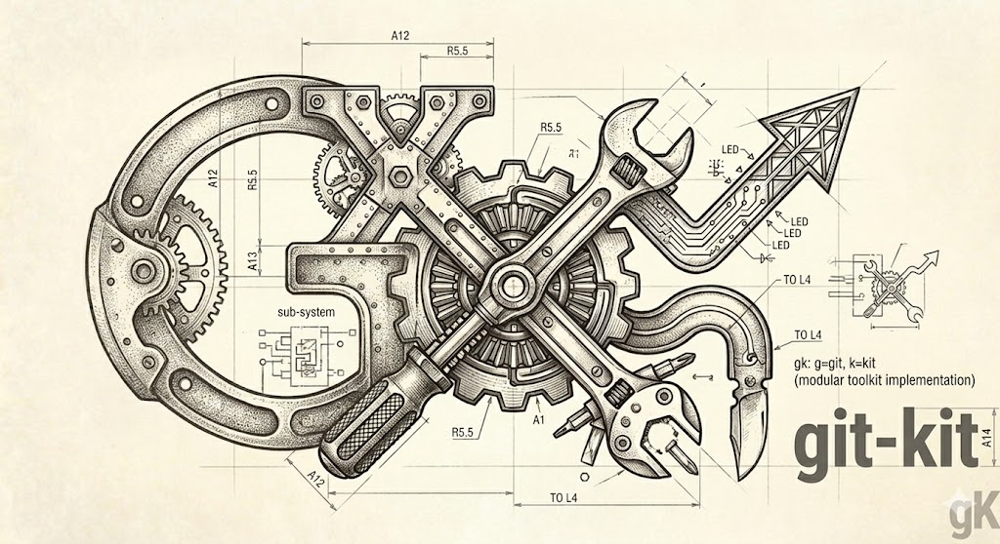

<p align="center">
  
</p>

<p align="center">
  <a href="README.md">English</a> · <strong>한국어</strong>
</p>

# gk — git 도우미

일상적인 pull/log/status/branch 워크플로를 위한 경량 Go git 도우미. **안전한 작업** (reflog 기반 undo, 타임머신 복원, 정책-as-code)과 **편리한 진단** (`doctor`, `precheck`, `sync`)에 초점을 둡니다.

[](https://golang.org/dl/)
[](https://github.com/x-mesh/gk/releases/latest)
[](LICENSE)

## 왜 gk인가?

- **기본적으로 더 안전한 push** — `gk push`는 push할 커밋 diff에서 AWS / GitHub / Slack / OpenAI 키와 PEM 본문을 스캔합니다. 보호된 브랜치 강제 push는 브랜치 이름을 직접 입력해야 합니다.
- **HEAD 타임머신** — `gk timemachine list`는 복구 가능한 모든 상태(reflog + gk 백업 refs)를 표시합니다. `gk timemachine restore <sha|ref>`은 먼저 백업 ref를 기록한 후 안전하게 리셋합니다. autostash 지원, 진행 중인 rebase/merge 상태에서는 거부합니다.
- **Reflog 기반 undo** — `gk undo`는 reflog에서 과거 HEAD를 선택(fzf 또는 번호)하여 리셋하고, `refs/gk/undo-backup/<branch>/<unix>`에 백업 ref를 남깁니다.
- **정책-as-code** — `gk guard check`는 저장소 정책 규칙(시크릿 스캔, 커밋 크기, 필수 트레일러)을 병렬로 평가합니다. `gk guard init`은 `.gk.yaml`에 주석 처리된 스텁을 스캐폴딩합니다. `gk hooks install --pre-commit`으로 pre-commit 훅에 연결할 수 있습니다.
- **드라이런 병합** — `gk precheck <target>`은 `git merge-tree`를 실행하여 작업 트리를 건드리지 않고 충돌 경로를 보고합니다(CI에서 exit 3).
- **원스텝 fast-forward** — `gk sync`는 리모트를 fetch하고 현재 브랜치(또는 `--all`로 모든 추적 브랜치)를 fast-forward합니다.
- **유연한 pull 전략** — `gk pull --strategy rebase|merge|ff-only|auto`로 호출 단위로 전략을 변경합니다. `@{u}` 추적 ref를 우선 사용하고, fast-forward 가능 시 자동으로 `merge --ff-only`로 전환합니다.
- **Conventional Commits 인식 훅** — `gk hooks install`은 `commit-msg` → `gk lint-commit`, `pre-push` → `gk preflight`, `pre-commit` → `gk guard check`를 연결합니다.
- **한눈에 보는 상태** — `gk doctor`는 git 버전, pager, fzf, `$EDITOR`, 설정 유효성, 훅 상태, gitleaks 설치 여부, gk 백업 ref 누적에 대해 PASS/WARN/FAIL을 보고하며 복사-붙여넣기 가능한 수정 명령을 제공합니다.
- **실행 가능한 에러** — 대부분의 에러에는 구체적인 다음 명령이 담긴 `hint:` 두 번째 줄이 출력됩니다.

## 설치

### Homebrew tap (권장)

```bash
brew install x-mesh/tap/gk
# 나중에 업그레이드:
brew upgrade x-mesh/tap/gk
```

### go install

```bash
go install github.com/x-mesh/gk/cmd/gk@latest
```

**git ≥ 2.38** 이 필요합니다(`merge-tree --write-tree`용; `gk precheck`가 충돌 경로를 이름으로 열거하려면 ≥ 2.40 권장). 설치 후 `gk doctor`로 확인하세요.

### oh-my-zsh 사용자: alias 충돌

oh-my-zsh의 `git` 플러그인이 `gk`를 `gitk` 런처로 정의하여 `gk` 바이너리를 가립니다. oh-my-zsh 로드 후 `~/.zshrc`에 충돌 alias를 제거하세요:

```zsh
unalias gk gke 2>/dev/null
```

## 빠른 시작

```bash
# 일상 작업
gk pull                      # fetch + rebase, upstream 자동 감지
gk pull --strategy ff-only   # fast-forward only; 히스토리 분기 시 에러
gk sync                      # fetch + fast-forward only (rebase 없음)
gk status                    # 간결한 작업 트리 요약
gk log                       # 짧고 컬러풀한 커밋 로그

# 안전
gk precheck main     # main으로 드라이런 병합; 충돌 시 exit 3
gk push              # 시크릿 스캔 + 보호 브랜치 규칙 적용
gk undo              # reflog에서 과거 HEAD 선택하여 복원

# 타임머신
gk timemachine list          # 복구 가능한 모든 HEAD 상태 (reflog + 백업)
gk timemachine restore <sha> # 안전 리셋 — 먼저 백업 ref 기록

# 정책
gk guard init        # .gk.yaml에 주석 처리된 정책 스텁 생성
gk guard check       # 모든 정책 규칙 평가; exit 0/1/2

# 온보딩
gk doctor            # 환경 상태 보고 + 수정 명령
gk hooks install --all       # commit-msg + pre-push + pre-commit 훅 연결

# 규약
gk lint-commit --staged    # Conventional Commits 기준으로 커밋 메시지 검증
gk branch-check            # 브랜치 이름 규칙 적용
gk preflight               # 설정된 검사 순서 실행
```

## 명령어

### 일상

| 명령어 | 별칭 | 설명 |
|---|---|---|
| `gk pull` | | fetch + upstream 통합. `--strategy rebase\|merge\|ff-only\|auto`; `@{u}` 우선 해석; HEAD가 이미 ancestor이면 `--ff-only`로 자동 전환 |
| `gk sync` | | fetch + fast-forward only; `--all`로 모든 추적 브랜치 |
| `gk status` | `gk st` | 간결한 작업 트리 상태. Opt-in `--vis gauge,bar,progress,types,staleness,tree,conflict,churn,risk` 오버레이 |
| `gk log` | `gk slog` | 짧은 컬러 커밋 로그. `--pulse`, `--calendar`, `--tags-rule`, `--impact`, `--cc`, `--safety`, `--hotspots`, `--trailers`, `--lanes` 시각화 |

### 브랜치

| 명령어 | 별칭 | 설명 |
|---|---|---|
| `gk branch list` | | `--stale <N>` / `--merged` / `--unmerged` / `--gone` 필터로 브랜치 목록 |
| `gk branch clean` | | 보호 목록을 존중하며 병합된 브랜치 삭제; `--gone`으로 upstream이 삭제된 브랜치 대상 |
| `gk branch pick` | | 인터랙티브 브랜치 선택기 (비TTY 폴백 포함) |
| `gk branch-check` | | 설정된 패턴에 대해 현재 브랜치 이름 검증 |
| `gk switch [name]` | `gk sw` | 브랜치 전환; `-m`/`--main`으로 main 이동, `-d`/`--develop`으로 develop |

### 안전

| 명령어 | 설명 |
|---|---|
| `gk push` | 가드된 push: 시크릿 스캔 + 보호 브랜치 적용; `--force`는 `--force-with-lease`로 라우팅 |
| `gk precheck <target>` | `git merge-tree`로 드라이런 충돌 스캔; 충돌 시 exit 3; CI용 `--json` |
| `gk preflight` | 설정된 검사 순서 실행 (`commit-lint`, `branch-check`, `no-conflict`, 또는 쉘 명령) |
| `gk lint-commit` | Conventional Commits 기준으로 커밋 메시지 검증; `--staged`, `--file PATH`, `<rev-range>` |

### 정책

| 명령어 | 설명 |
|---|---|
| `gk guard check` | 모든 정책 규칙을 병렬로 평가; human 또는 `--json` 출력; exit 0 clean / 1 warn / 2 error |
| `gk guard init` | 완전히 주석 처리된 `policies:` 블록으로 `.gk.yaml` 스캐폴드; `--force` 덮어쓰기, `--out` 경로 지정 |

### 복구

| 명령어 | 별칭 | 설명 |
|---|---|---|
| `gk timemachine list` | | reflog + gk 백업 refs의 통합 타임라인; `--kinds`, `--json` (NDJSON) |
| `gk timemachine restore <sha\|ref>` | | 안전 리셋: 먼저 백업 ref 기록 후 리셋; `--mode soft\|mixed\|hard\|auto`, `--dry-run`, `--autostash` |
| `gk timemachine list-backups` | | gk 관리 백업 refs만; `--kind undo\|wipe\|timemachine`, `--json` |
| `gk timemachine show <sha\|ref>` | | 타임라인 항목의 커밋 헤더 + diff stat (또는 `--patch`) |
| `gk undo` | | Reflog 기반 HEAD 복원; `refs/gk/undo-backup/...`에 백업 ref 남김 |
| `gk reset` | | upstream으로 hard-reset; `--to-remote`는 `<remote>/<current>` 사용 |
| `gk wipe` | | `reset --hard` + `clean -fd`; `refs/gk/wipe-backup/...`에 pre-wipe HEAD 백업 |
| `gk restore --lost` | | 댕글링 커밋/blob을 cherry-pick 힌트와 함께 표시 |
| `gk edit-conflict` | `gk ec` | 첫 번째 `<<<<<<<` 마커에서 에디터 열기 |
| `gk continue` | | 중단된 rebase/merge/cherry-pick 계속 |
| `gk abort` | | 중단된 rebase/merge/cherry-pick 취소 |
| `gk wip` / `gk unwip` | | 컨텍스트 전환용 임시 WIP 커밋 |

### 온보딩 / 설정

| 명령어 | 설명 |
|---|---|
| `gk doctor` | 환경 상태 보고 (git/pager/fzf/editor/config/hooks/gitleaks/backup-refs); `--json` for CI |
| `gk hooks install [--commit-msg\|--pre-push\|--pre-commit\|--all] [--force]` | `.git/hooks/` 아래 gk 관리 훅 심 설치 (`--pre-commit`은 `gk guard check` 연결) |
| `gk hooks uninstall [...]` | gk 관리 훅 제거 (외부 훅은 삭제 거부) |
| `gk config show` | 완전히 해석된 설정을 YAML로 출력 |
| `gk config get <key>` | 점 경로로 단일 설정 값 출력 |

전체 플래그 참조는 [docs/commands.md](docs/commands.md), 릴리즈별 상세 내용은 [CHANGELOG.md](CHANGELOG.md)를 참조하세요.

## 전역 플래그

| 플래그 | 설명 |
|---|---|
| `--dry-run` | 실행 없이 동작 출력 |
| `--json` | 지원되는 경우 JSON 출력 |
| `--no-color` | 컬러 출력 비활성화 |
| `--repo <path>` | git 저장소 경로 (기본값: 현재 디렉토리) |
| `--verbose` | 상세 출력 |

## 설정

gk는 우선순위 순서로 여러 소스에서 설정을 읽습니다 (높은 것이 우선):

1. CLI 플래그
2. `GK_*` 환경 변수
3. `git config gk.*` 항목
4. 저장소 루트의 `.gk.yaml`
5. `~/.config/gk/config.yaml` (XDG)
6. 내장 기본값

모든 필드는 [docs/config.md](docs/config.md)를 참조하세요. 샘플 설정은 [examples/config.yaml](examples/config.yaml)에 있습니다.

## 종료 코드

| 코드 | 의미 |
|:-:|---|
| 0 | 성공 |
| 1 | warn (`gk guard check`: 경고 수준 위반) / 일반 에러 |
| 2 | 잘못된 입력 / `gk guard check`: 에러 수준 위반 |
| 3 | 충돌 (merge/rebase/precheck) |
| 4 | 분기됨 (fast-forward 불가) |
| 5 | 네트워크 에러 |

스크립트는 릴리즈 간 안정성을 보장받을 수 있습니다.

## 개발

```bash
git clone https://github.com/x-mesh/gk.git
cd gk

make build          # bin/gk에 출력
make test           # go test ./... -race -cover
make lint           # golangci-lint run
make fmt            # gofmt + go mod tidy
```

Go 1.25+ 및 git 2.38+가 필요합니다.

## 라이선스

[MIT](LICENSE)
